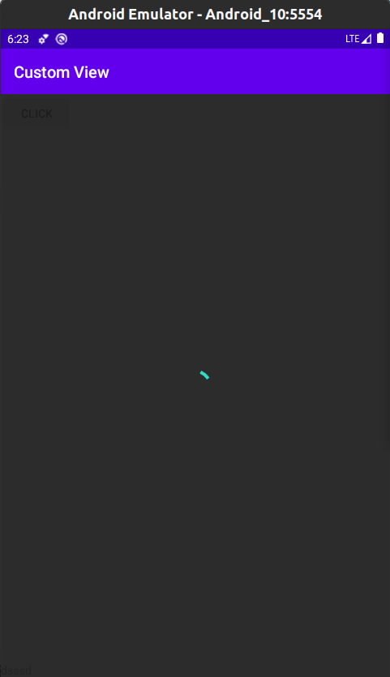
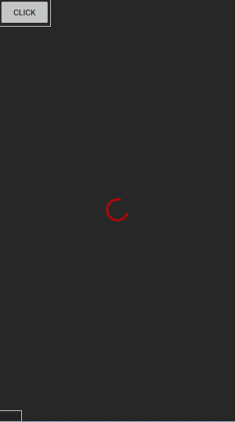

# Custom-View-Group-Loading 
A simple Lib to make a progress bar indicator behind the views to show loading or progress something


<p float="left">
 	
	
</p>

**Step 1.** Add it in your root build.gradle at the end of repositories:

``` groovy
allprojects {
		repositories {
			...
			maven { url 'https://jitpack.io' }
		}
	}
```

**Step 2.** Add the dependency

``` groovy
dependencies {
	  implementation 'com.github.Eng-AhmedShehata:Custom-View-Group-Loading:1.1'
	}
```

---

``` xml
	<com.ashehata.mycustomvg.RelativeLayoutLoading
        android:id="@+id/rl_loading"
        app:progress_color="@android:color/holo_red_dark"
        app:show_loading="true"
        app:container_alpha=".9"
        android:layout_width="wrap_content"
        android:layout_height="wrap_content"
        app:layout_constraintTop_toTopOf="parent"
        app:layout_constraintStart_toStartOf="parent">

        <TextView
            android:layout_alignParentBottom="true"
            android:layout_width="wrap_content"
            android:layout_height="wrap_content"
            android:text="dsasd"/>

    </com.ashehata.mycustomvg.RelativeLayoutLoading>

```

**How to use it (XML)**
* app:progress_color to change progress color
* app:show_loading to show or hide container
* app:container_alpha to control opacity of layer (value from 0 to 1)


**How to use it (code)**
``` kotlin
	// to show / hide progress
	rl_loading.loadingProgress(true)
	
	// to chnage layer opacity
        rl_loading.setContainerAlpha(1F)

```


